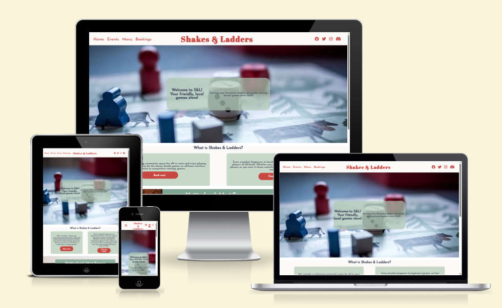
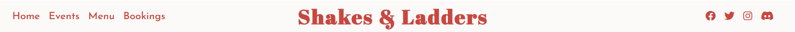
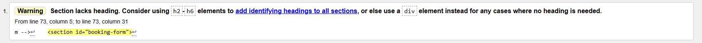
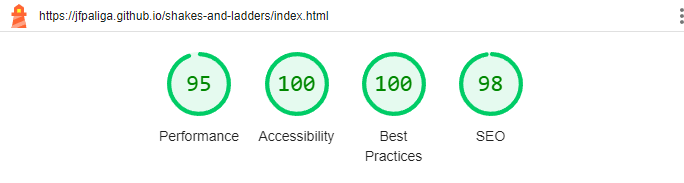
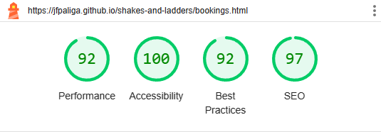

# Shakes and Ladders

The [Shakes and Ladders](https://jfpaliga.github.io/shakes-and-ladders/) website is a page built for a board games store located in Nottingham. The website advertises
the store and provides information to potential customers.

External users of this website will be able to learn more information about the store, what they can do at the store and they can look at a calendar to
see future events taking place at the store. Users will also be able to browse a menu of milkshakes that are offered at the store and make a reservation
at the store through a booking form.

The goal for the owner of the site is to advertise the store and increase awareness, attract new customers and retain customers with interesting events and
to book out seats at the store to generate revenue.

## Features

- Navigation

  - Located at the top of each page, with the business logo positioned in center that also acts as a link back to the home page.
  - The nav menu on the left is in clear, large text with a hover element to indicate an interactive element. Each link takes the user either to another page on the site or another section within a page.
  - The icons on the right provide a link to the different social media pages of the business, with aria-labels on each to provide accessibility to those with screen readers.
  - All elements within the navigation bar are coloured in a shade of red to draw the users attention.

- Hero Image
- About Us
- Events
- Menu
- Booking

## Testing

- Check different browsers and responsive design.
- Check readability.
- Check links.
- Check form entry.

### Validator Testing

- HTML

  - No errors were returned when passing through the official W3C validator.
  - One warning was given regarding the use of a section with no heading, however as all the content within the section was related I believe it is still the appropriate semantic element to use.

  

- CSS

  - No errors were returned when passing through the official W3C Jigsaw validator.

- Accessiblity

  - I confirmed the accessibility of all website pages was good via the use of Lighthouse in the dev tools.

  
  
  

## Bugs

Fixed and unfixed.

z-index on events page breaking links

## Deployment

Write up GitHub deployment.

## Credits

### Content

- CSS and HTML for Hamburger nav menu was taken from [alvarotrigo.com](https://alvarotrigo.com/blog/hamburger-menu-css/)
- CSS code for carousel on the Events page was taken from [css-tricks.com](https://css-tricks.com/css-only-carousel/)

### Media

- The background image in the hero image section and the milkshake images were taken from [Pexels](https://www.pexels.com/)
- The images on the events and booking pages were taken from [Unsplash](https://unsplash.com/)
