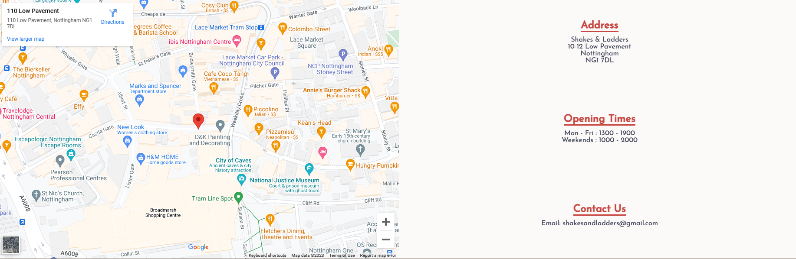
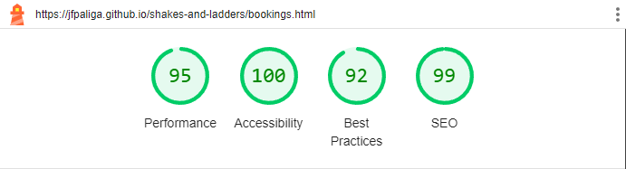

# Shakes and Ladders

The [Shakes and Ladders](https://jfpaliga.github.io/shakes-and-ladders/) website is a page built for a board games store located in Nottingham. The website advertises
the store and provides information to potential customers.

External users of this website will be able to learn more information about the store, what they can do at the store and they can look at a calendar to
see future events taking place at the store. Users will also be able to browse a menu of milkshakes that are offered at the store and make a reservation
at the store through a booking form.

The goal for the owner of the site is to advertise the store and increase awareness, attract new customers and retain customers with interesting events and
to book out seats at the store to generate revenue.

The target audience would be those with an interest in board games who are looking for a friendly environment to play in and for those that would have enough of an interest to attend regular events.

## Features

- Navigation

  - Located at the top of each page, with the business logo positioned in center that also acts as a link back to the home page.
  - The nav menu on the left is in clear, large text with a hover element to indicate an interactive element. Each link takes the user either to another page on the site or another section within a page.
  - The icons on the right provide a link to the different social media pages of the business, with aria-labels on each to provide accessibility to those with screen readers.
  - All elements within the navigation bar are coloured in a shade of red to draw the users attention.

- Landing Image

  - User is greeted with an eye-catching image on the landing page with elements familiar to those who enjoy playing board games.
  - A brief introductory statement is provided to let the user know where they are and what the business offers.

- What is Shakes & Ladders?

  - This section offers a little more information about the business.
  - The section is broken into two divisions, on the left a general statement about the business ethos and what the business does, and on the right a statement introducing events at the business.
  - Both divisions contain links to relevant pages on the website, coloured in red to draw the users attention and with hover elements to indicate interactivity.

- Menu

  - This section offers a menu of milkshakes that can be ordered at the business with prices included on each item.
  - Images accompanying the menu offer the user an indication of what the milkshakes available might look like.

- Events Page

  - The events page offers more information on what kind of events take place at the business and introduces other content on the page.
  - The major events section features a carousel that goes into more details on the three games that the business hosts regular tournaments of.
  - Each slide of the carousel introduces the game and offers a link to an official game for users who want to learn more.
  - The carousel can be navigated by the icons below the carousel that are coloured in red to draw the attention of the user and have a hover element to indicate they can be interacted with.

- Event Calendar

  - The events calendar provides the user with information on events taking place at the business over the next 5 months.
  - Each month is broken down into the dates and a description of what the event is.

- Booking Form

  - The booking page provides a form for the user to fill in their details in order to book a table at the business.
  - The form collects the name, email, number of people attending and the date of the visit from the user.
  - The form also allows the user whether to opt in or out of being contacted by the business about events and special offers.
  - The form provides a comment field for any additional requests the user may have.
  - The form is currently a dummy form and as such won't collect any information via get or post methods.
  - The submit button carries the user to a separate page thanking them for their interest and informing them they will receive a confirmation email.

- Map and Address

  - This section includes an interactive Google maps location to aid the user in locating the business.
  - The address, opening times and an email address for the business can also be found in this section.

- Footer

  - The footer of the website provides the copyright information and three links.
  - Two links are provided that will bring the user to the map and contact details section of the website from any page.
  - The 'Back to the top' button will scroll each website page back to the top of the content.

## Testing

- I have tested that each page of the website and it's features works on the following browsers: Chrome, Edge, Firefox.
- I have confirmed that each page is responsive, looks good and functions on all screen sizes by using the browser developer tools.
- I have confirmed that all text is readable and understandable.
- I have confirmed that all links are working as intended.
- I have confirmed that the form validation works: the form cannot be submitted unless a name, email, party size and date is provided and the email field will only accept an email.
- As the form is only a dummy, the submit button will take the user to a confirmation page but the information is not stored.

### Validator Testing

- HTML

  - No errors were returned when passing through the official W3C validator.
  - One warning was given regarding the use of a section with no heading, however as all the content within the section was related I believe it is still the appropriate semantic element to use.

  

- CSS

  - No errors were returned when passing through the official W3C Jigsaw validator.

- Accessiblity

  - I confirmed the accessibility of all website pages was good via the use of Lighthouse in the dev tools.

  
  
  

## Bugs

- Resolved bugs

  - On implementing the burger nav menu, I found that the menu wouldn't display properly on the events page.
  - I concluded that this was due to relative positioning and a left float being used with the events sections, so I assigned a z-index: -1 to the events-section class.
  - This, however, caused the carousel links to become non-functional and non-interactive and so to resolve this I assigned a z-index: 0 to the major events section, which was able to fix the links whilst also allowing the burger menu to display properly.

- Unresolved bugs

  - There were no unresolved bugs.

## Deployment

- The website was deployed using GitHub Pages. The steps to deploy were taken as follows:

  - From the GitHub repository, navigate to the Settings tab.
  - On the nav menu on the left hand side, navigate to Pages.
  - From the Source dropdown menu, select 'Deploy from a branch'.
  - From the Branch dropdown menu, select 'main'.
  - Once these have been selected, click Save and GitHub provides a link to the website.

## Credits

### Content

- CSS and HTML for Hamburger nav menu was taken from [alvarotrigo.com](https://alvarotrigo.com/blog/hamburger-menu-css/)
- CSS code for carousel on the Events page was taken from [css-tricks.com](https://css-tricks.com/css-only-carousel/)

### Media

- The background image in the hero image section and the milkshake images were taken from [Pexels](https://www.pexels.com/)
- The images on the events and booking pages were taken from [Unsplash](https://unsplash.com/)
